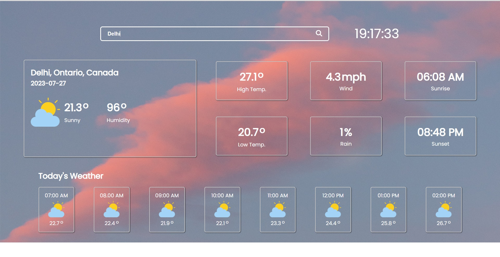

# Weather App

 

## Preview

[Weather App Live Preview](https://weatherforcastapp.netlify.app/)

The Weather App is a simple web application built using JavaScript that provides real-time weather information for a specified location. It utilizes the OpenWeatherMap API to fetch weather data and display it in an easy-to-read format for users.

## Features

- User-friendly interface: The app has a clean and intuitive design, making it easy for users to interact with and understand.

- Real-time weather data: The app fetches the latest weather information from the OpenWeatherMap API, ensuring that users receive up-to-date data for their chosen location.

- Search functionality: Users can input the name of a city or location to get weather details specific to that area.

## How to Use

1. Clone the repository to your local machine using the following command:

2. Open the `index.html` file in your web browser.

3. Enter the name of a city or location in the search bar and press "Enter" or click the "Search" button.

4. The app will display the current weather information for the specified location, including temperature, humidity, wind speed, and weather description.

## Dependencies

The Weather App uses the following dependency:

- [weatherapi API](https://www.weatherapi.com/): The app fetches weather data from this API to provide real-time weather information.

## Contributing

If you wish to contribute to this project, feel free to create a pull request with your proposed changes. Any improvements, bug fixes, or additional features are welcome!

## License

This project is licensed under the [MIT License](LICENSE). Feel free to modify and distribute this project as per the terms of the license.

## Acknowledgments

- Special thanks to the creators of the Weatherapi API for providing the data source for this app.

    Thank you for checking out the Weather App! Enjoy and stay weather-informed!

